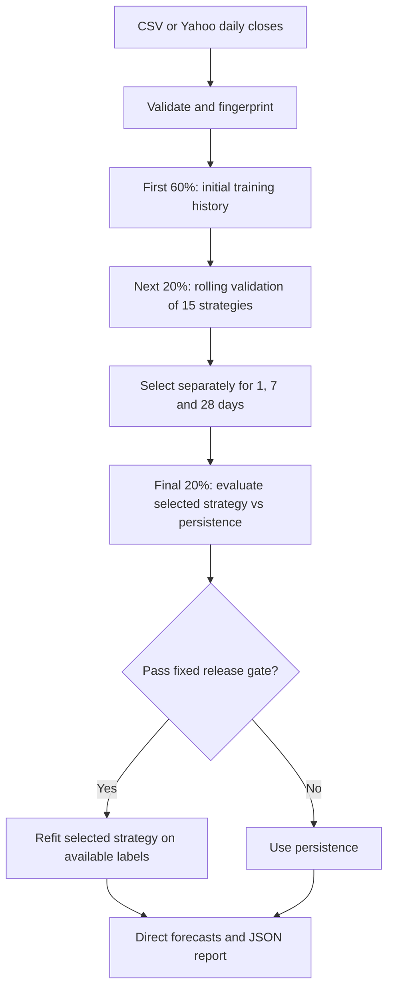

# Crypto price forecasting

A local research pipeline that reports **up, down, same or inconclusive** for
Bitcoin at 1-, 7- and 28-day horizons. It evaluates a directional classifier
chronologically and abstains when its confidence or measured performance is
insufficient. Earlier price-regression experiments remain available for comparison. The project began as a Lambda/LSTM prototype in 2023.

**Status:** research, not a proven trading strategy. Lower historical price error
is not evidence of profitability. See [the recorded experiment](docs/experiments.md)
for measured results and limitations.

## Run with Docker Compose

With Docker Desktop running, from the repository root:

```sh
docker compose up --build
```

`BTC-USD` and directional classification are CLI defaults, including when
`docker compose run` replaces the service command. For example,
`docker compose run --rm predictor --history-days 730` uses Bitcoin and the
direction model automatically. Pass `--ticker ETH-USD` or `--model auto` to
override them.

The first run requests up to twelve years of Yahoo Finance `BTC-USD` daily
closes (Yahoo may return less for dates before the asset was listed); later runs
update the persistent SQLite cache. Training and evaluation use the latest
**365 days by default**. Each run trains, calibrates and evaluates a directional
model per horizon, then writes:

- `artifacts/btc-direction.json`: labels, class probabilities, abstention reasons,
  validation/final call accuracy and coverage, and holdout predictions.
- `artifacts/btc-direction.prices.csv`: the exact normalized input snapshot.
- `artifacts/prices.sqlite3`: reusable daily history, keyed by ticker and date.

The command prints progress and a per-horizon result, then exits. Code 0 means
success, including when every forecast is inconclusive. Each run overwrites
the report and CSV, while the database retains history. Internet is required for downloads; the first image build and
training may take several minutes. No web server or separate database service is needed.

The original `artifacts/btc.json`, if present, is the earlier LSTM result and is
not overwritten. To rerun the earlier price-regression comparison on its identical saved prices:

```sh
docker compose run --rm predictor --csv artifacts/btc.prices.csv --model auto \
  --output artifacts/replay-auto.json
```

If Yahoo rate-limits downloads, the live workflow uses its SQLite cache when
available and prints a warning with the last stored date. Without a cache, you can
still run the saved real Bitcoin snapshot without any network requests:

```sh
docker compose run --build --rm replay
```

This requires `artifacts/btc.prices.csv` from the earlier successful run. It writes
`artifacts/replay-auto.json`; forecasts are relative to the snapshot's final date,
not necessarily today. If your snapshot has another filename, use the explicit
`--csv` command above.

## Directional labels and confidence

The default directional command uses the latest year while preserving all cached
history:

```sh
docker compose run --build --rm predictor --ticker BTC-USD --offline \
  --model direction --output artifacts/btc-one-year.json
```

`--history-days` defaults to 365 and selects the latest N available consecutive
daily observations for training/evaluation; it does not delete older cached rows
or alter confidence gates. Pass another positive number to override it. Omit
`--offline` to update the cache first. With 365 rows, the 60/20/20 split
leaves only 73 validation and 73 final-test targets. A shorter history is a research
choice, not a guarantee of more reliable calls. See the
[recorded one-year comparison](docs/one-year-comparison.md).

The cache keeps up to twelve years so cycle studies can include multiple bull,
bear and halving-era regimes. To train on the full cached window, pass an
explicit value such as `--history-days 4380`; the default remains one year so
recent market behavior is not diluted by older regimes. Compare windows with
walk-forward evaluation before treating a longer history as an improvement.

When complete `Open`, `High`, `Low`, `Close` and `Volume` bars are available, the
directional model also uses candle range, candle body, close position, volume
change and rolling volatility features. Every feature is calculated from the
completed candle and earlier candles only. Existing close-only caches and CSVs
continue to work with the close-return feature set; run `--full-refresh` once to
populate OHLCV context for an older cache.

| Label | Meaning |
| --- | --- |
| `up` | Qualified model assigns enough probability to a rise beyond the flat band |
| `down` | Qualified model assigns enough probability to a fall beyond the flat band |
| `same` | Qualified model assigns enough probability to remaining inside the flat band |
| `inconclusive` | Model did not qualify, class history is insufficient, or confidence is too low |

“Same” means **roughly flat**, never exactly unchanged. Band endpoints are included:
with a 1% band and a reference close of $100, both $99 and $101 count as same.
Defaults are ±1% for one day, ±3% for seven days and ±5% for 28 days. These are
explicit research choices, not tuned optimal values. Change them before evaluating:

```sh
docker compose run --rm predictor --ticker BTC-USD --offline --model direction \
  --confidence-threshold 0.65 --flat-band-1d 0.01 --flat-band-7d 0.03 \
  --flat-band-28d 0.05 --output artifacts/btc-direction.json
```

A standardized logistic classifier uses recent daily log returns and their
summary statistics. Each rolling fit uses mature labels only. Its most recent
20% of eligible observations calibrate probabilities with sigmoid calibration;
the earlier observations train the model, with a gap purging overlapping target
labels at the boundary. Training and calibration each need at least five examples
of all three outcomes; otherwise the model abstains. Refits occur every 30 target
days. The first 60% supplies initial history, the next 20% validates the policy,
and the final 20% checks it. Forecast models then refit on available history.

An individual call needs an estimated class probability of at least 65%. Both
validation and final evaluation must also meet all of these fixed quality gates:

- At least 30 calls and 10% call coverage.
- At least 65% accuracy on those calls.
- At least five percentage points better accuracy than a historical-prior
  majority-class baseline **on those same called dates**.
- Multiclass Brier score no worse than that prior baseline on all dates with
  available model probabilities, including low-confidence predictions.

Call accuracy and coverage describe the candidate before the qualification gate;
if it fails, the emitted forecast is inconclusive. Zero calls yield `null`
accuracy, not 100%. Calibration is an estimation procedure, not a guarantee that
the stated probabilities are reliable. Gates are engineering criteria, not
statistical significance tests. Existing historical data has been explored before;
prospective evidence is still required.

The JSON includes `reference_close` (the last observed close), `flat_band`,
`probabilities`, `label`, `confidence` and `reason`. It does **not** invent a future
exact price. Inconclusive results have `confidence: null`; class probabilities
remain visible for diagnosis if a classifier could be fitted. A persistence
fallback never becomes `same` merely because its price forecast is flat.

Directional mode needs at least 300 consecutive rows, and more for long custom
horizons. Tests cover the decision API and actual CLI output using red → green
slices: happy paths, abstention, malformed probabilities, invalid data/config,
chronological isolation, band boundaries and JSON/terminal agreement.

## Incremental price cache

SQLite lives in the existing `artifacts/` bind mount and survives container
recreation. No database service is needed. Every online update requests missing
days plus the last seven stored candles, so recent provider corrections replace
old values. If an older internal gap exists, the request starts at the earliest
missing date. Complete, validated merged history is required before any changes
are committed. Today's incomplete candle is never stored.

To train from the database without making a network request:

```sh
docker compose run --rm predictor --ticker BTC-USD --offline --model direction \
  --output artifacts/btc-offline.json
```

To refresh all history, including older corrections:

```sh
docker compose run --rm predictor --ticker BTC-USD --full-refresh --model direction \
  --output artifacts/btc-refresh.json
```

`--cache PATH` selects another SQLite file. `--offline` and `--full-refresh` cannot
be combined. A full refresh covers up to twelve years and any older stored rows.
CSV input bypasses the cache; experiment snapshots remain immutable inputs when
you save them under distinct filenames.

On provider failures, only a valid, contiguous cached series can be used. The
console shows its last date and how many completed days are missing. JSON reports
record this in `data_access`, including `mode`, `as_of`, `missing_recent_days`,
the requested range and any provider warning. Forecast dates follow the last data
date, even when it is old. An empty cache or unrepaired gap fails clearly rather
than training on invented prices. Cached history is retained as it grows; it is
not trimmed to a rolling ten-year window.

The optional synthetic baseline demo runs with `docker compose run --build --rm demo`.
`docker compose down` removes stopped containers; reports remain. Containers run
as UID 1000; on Linux the bind-mounted `artifacts/` directory must be writable by
that user. Docker Desktop normally handles this automatically.

## Run with Python

Use Python 3.11:

```sh
python3 -m venv .venv
source .venv/bin/activate
pip install -r requirements-online.txt
python -m crypto_predictor --ticker BTC-USD --model direction --output artifacts/btc-direction.json
python -m unittest discover -s tests -v
```

For offline CSV work, install only `requirements.txt`. CSVs require `Date,Close`
columns, positive finite prices, and consecutive daily observations. Input is
sorted; duplicates, gaps and missing values fail explicitly. No future prices
are imputed. Live downloads exclude today's potentially incomplete candle.

For an offline search smoke test:

```sh
python -m crypto_predictor --csv examples/synthetic.csv --model auto
```

The fixture is synthetic and cannot establish Bitcoin prediction quality.

## Bounded research: up to ten iterations

```sh
docker compose run --build --rm research
```

This separate research job adds daily open/high/low prices and volume. It downloads
one Bitcoin OHLCV snapshot if `artifacts/research/ohlcv.csv` is absent, then reuses
that frozen file across every iteration and future reruns. The production SQLite
cache stores closes only; its data is not overwritten. Use `--refresh-data` only
when intentionally starting a new research snapshot.

The job compares nine predefined recipes and a tenth ensemble of the three best
validation recipes. `--max-loops N` accepts only 1–10. Intermediate results are
checkpointed in `artifacts/research/report.json`, alongside an exact input snapshot.
Rerunning overwrites that report and is additional research, not fresh evidence.

The objective is fixed: next-day price MAE at least 5% below persistence, wins in
at least 60% of 30-day blocks, and positive improvement in both halves of each
evaluation period. The first 40% provides initial training history, the next 40%
selects candidates, and one frozen winner is checked on the final 20%. All models
refit every 30 days using only labels already observed. Price-weighted absolute
simple-return loss aligns median regression and tree training with dollar MAE;
ridge remains a squared-error control.

The final check also requires positive lower endpoints in descriptive paired
block-bootstrap intervals (30- and 90-day blocks). These are engineering gates,
not proof of future performance or corrections for prior research on this history.
If no candidate qualifies in validation, the single best validation candidate is
still evaluated once for diagnosis and explicitly remains unqualified. No other
candidate is selected from the final results. Production forecasts are never
changed automatically by this exploratory job.

See [the ten-iteration results](docs/ten-iteration-research.md) for the recorded run.

## Earlier price-regression algorithms (`--model auto`)

| Strategy family | Candidates | Training target |
| --- | ---: | --- |
| Persistence | 1 | No fit: use the latest observed close |
| Historical median | 3 | Median log return over 30, 90 or 365 matured samples |
| Historical mean, shrunk toward zero | 2 | Mean log return over 90 or 365 samples, multiplied by 0.25 |
| Ridge regression | 5 | Direct future log return from lagged returns and summary statistics |
| Gradient-boosted trees | 4 | Same return features, with absolute-error loss |

Linear models use 7, 14 or 30 return lags, training windows of 90–1,095 samples,
standardization fitted only on training rows, and L2 regularization. Trees use
14 lags, 7 or 15 leaves, 60 boosting iterations, and 365–1,095 training samples.
Early stopping is disabled to avoid an implicit random validation split.
Some candidates shrink predicted log returns by 0.25, a conservative blend toward
zero return. Exact candidate parameters are recorded in every report.

Predicting log returns instead of raw price levels permits comparison across
price regimes. Convert a prediction back with `latest_close * exp(predicted_return)`.
Each horizon has its own fitted model; forecasts are direct, not recursively
fed into subsequent inputs. This does not guarantee that the models beat persistence.

## Earlier price-regression flow (`--model auto`)



**Chronology:** models refit every 30 target days. At each fit, only targets whose
future close is already observed are eligible for training. An h-day forecast
for date t can use prices only through t−h. Past evaluation observations become
available as time advances, but later observations never enter earlier fits.
All candidates use identical validation target dates at a given horizon.

**Selection:** choose the lowest validation MAE among candidates that improve on
persistence by at least 1% and beat it in at least 60% of validation blocks.
Otherwise select persistence. MAE is the selection objective; RMSE is also
reported. All horizon selections finish before final-period scoring.

**Release gate:** the validation-selected challenger must then reduce final-period
MAE by at least 1%. Otherwise future forecasts use persistence; no other challenger
is selected from final-period results. The report retains the selected model's
actual final metrics even if it fails this gate. These thresholds are engineering
rules, not statistical significance tests.

A flat forecast means that no challenger qualified, not that the future price is
certain. These price forecasts now also carry `label: inconclusive` and no class
probabilities: a point-price regression does not establish directional confidence.
The report exposes `selected`, `forecast_strategy` and `status` separately.

## Reproducibility and tests

Reports record the data hash, dates, complete search space, seed, gates, runtime
versions, validation folds, final predictions and forecast strategy. Reuse a saved
CSV and a distinct output filename to compare runs without changing source data.
Direct dependencies are pinned; transitive dependencies and the Docker base image
are not fully locked, so cross-platform bitwise reproducibility is not promised.

Tests verify horizon alignment, label maturity, future-data isolation, train-only
scaling, validation/test separation, baseline fallback, successful-model refitting,
invalid inputs, stable fingerprints and baseline metrics. CI includes the offline
comparison command and the original LSTM smoke test.

## Original LSTM experiment

The original comparison remains available for inspection:

```sh
pip install -r requirements-optional.txt
python -m crypto_predictor --csv artifacts/btc.prices.csv --model lstm \
  --output artifacts/lstm.json
```

It uses two 50-unit LSTM layers and a dense output, Adam/MSE, 90 price observations,
10 epochs and an 80/20 split. Scaling fits only on the training partition. Its
one-step observed-history evaluation does **not** evaluate its recursive 28-day
forecast. It is not part of the automatic search; the return-based candidates are
cheaper to compare repeatedly. TensorFlow is excluded from the default research
image and is available in the Dockerfile's `full` target.

## Deployment and limits

Use a local batch container for this scope. Serverless adds no benefit to the
current experiment workflow. Schedule the container if regular refreshes become
necessary; separate training from inference and version model/scaler artifacts
if an actual API consumer appears.

- The final period was already examined in the earlier LSTM experiment. These
  results are retrospective; newly arriving data is needed for independent evidence.
- Repeated exploration can overfit validation. The search is finite and logged;
  rerunning it until a winner appears does not establish predictive value.
- Daily multi-day targets overlap, so errors are dependent. Fold wins and a 1%
  improvement are not confidence intervals or proof of significance.
- The final period also gates release. Its score evaluates the frozen selected
  challenger, not an independently tested model-selection policy.
- Only closing prices are used. No volume, order books, news, trading costs,
  execution simulation, risk controls or prediction intervals are implemented.
- Models are refitted each run and not persisted. Forecast quality can deteriorate
  with market changes, even when historical gates pass.

Methodology references: [time-series cross-validation](https://scikit-learn.org/stable/modules/cross_validation.html#time-series-split),
[avoiding preprocessing leakage](https://scikit-learn.org/stable/common_pitfalls.html#data-leakage),
and [gradient-boosting parameters](https://scikit-learn.org/stable/modules/generated/sklearn.ensemble.HistGradientBoostingRegressor.html).
